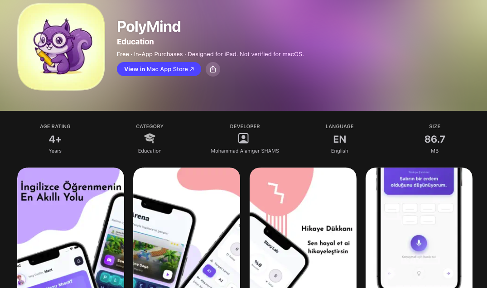
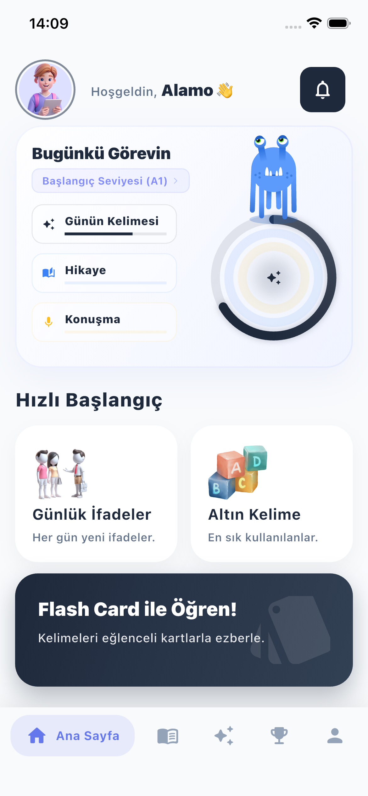
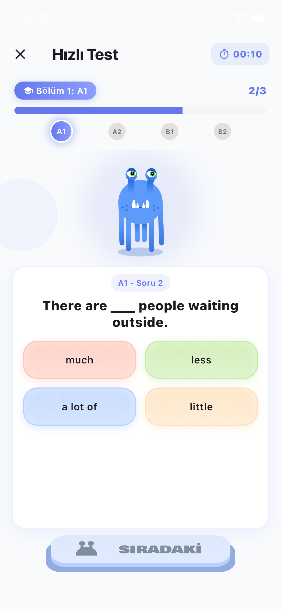
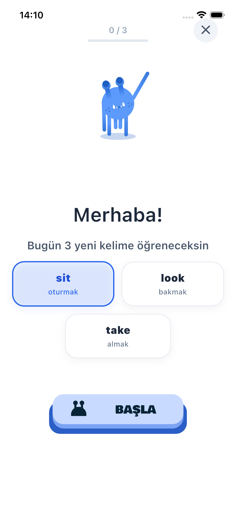
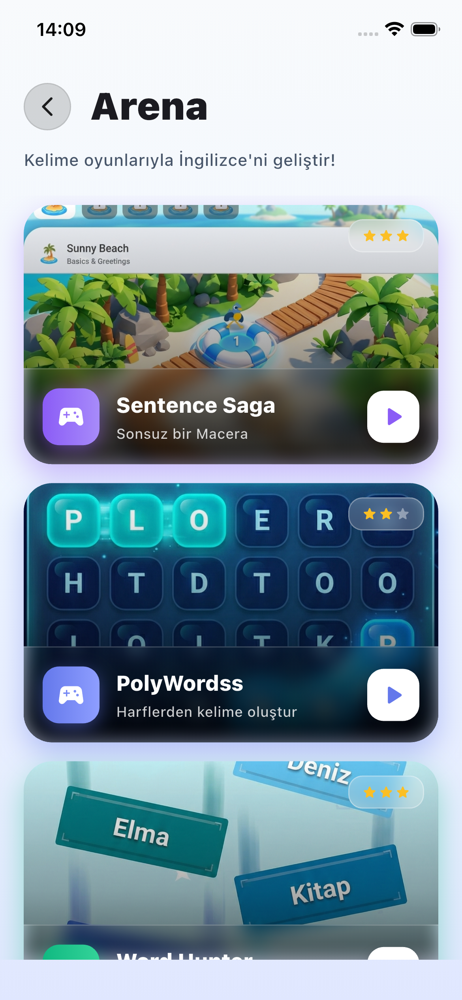
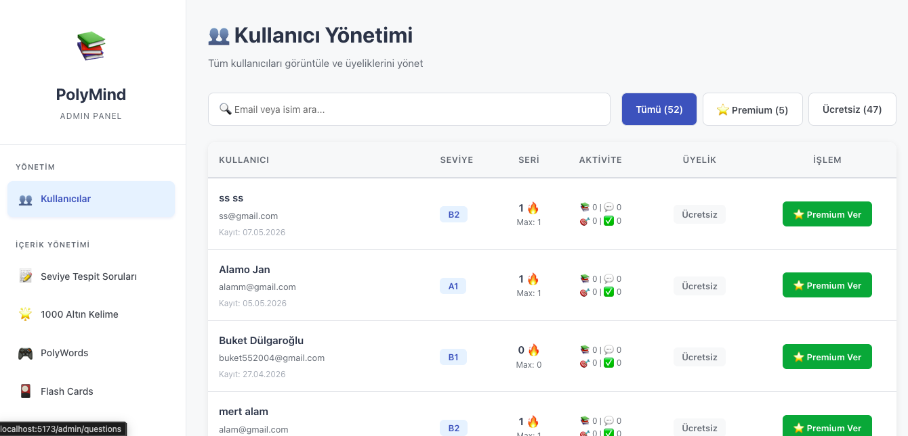
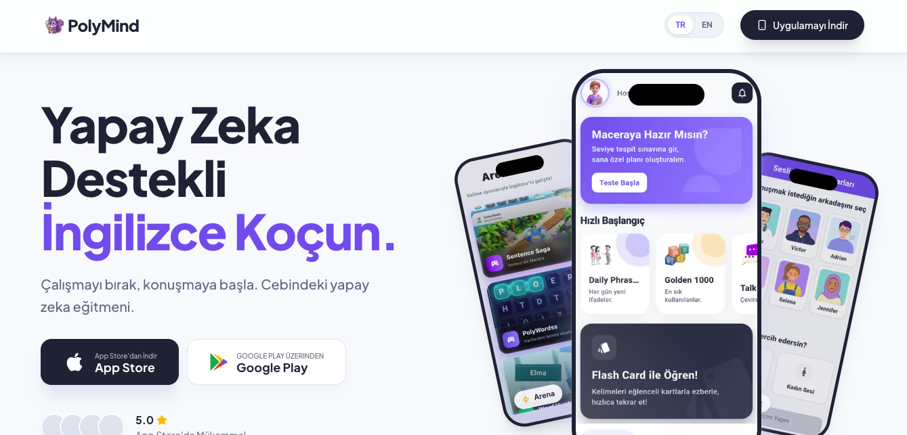

# Polymind - AI-Powered Language Learning Ecosystem

👉 **[Türkçe Versiyon İçin Tıklayın (Read in Turkish)](README.md)** 👈

> **Note:** This repository is intended **strictly for portfolio and showcase purposes**. The source code for the Polymind ecosystem (Mobile App, Backend, Admin Panel, and App Landing) is maintained in private enterprise repositories to protect proprietary intellectual property and business logic.

## About The Project
Polymind is not just a mobile application; it is a full-fledged language learning ecosystem designed to make language acquisition natural, immersive, and AI-supported. Currently live on the App Store, it combines advanced speech recognition, spaced repetition algorithms, and minigames to redefine the educational experience.

## Ecosystem Showcase

### App Store Presentation

  

### Mobile App Screens

  
  &nbsp; &nbsp; &nbsp; &nbsp;
  

 

  
  &nbsp; &nbsp; &nbsp; &nbsp;
  

### Interactive Mini Games

  

### CMS / Admin Dashboard

  

### Mobile App Landing Website

  

---

## Technical Architecture & Tech Stack

The architecture is distributed into 4 main decoupled micro-applications, built with the latest enterprise-level standards.

### 1. Mobile Application (iOS/Android)
Developed to deliver a highly interactive 60fps+ native experience.
* **Core:** Flutter SDK, Dart
* **State Management & Routing:** Riverpod, GoRouter
* **Engines & UI:** Flame (for in-app 2D games), Lottie (Animations), Liquid Swipe
* **Integrations:** RevenueCat (In-App Purchases), Firebase Suite (Core, Analytics, Crashlytics, Perf), AdMob
* **AI & Hardware:** Speech-to-Text & Flutter TTS for vocal language corrections.

### 2. High-Performance API Backend
A robust, scalable RESTful API handling business logic, user data, and real-time syncing.
* **Core:** Node.js, Fastify (High-throughput framework)
* **Databases & ORM:** SQL + Prisma ORM for type-safe database queries.
* **AI Integration:** Groq SDK for AI-generated personalized language content.
* **Security & Auth:** JWT, Bcrypt, Fastify Rate Limit, Helmet. Cloudinary for secure asset storage.

### 3. CMS / Admin Dashboard
A deeply customized React application to manage the entire mobile app's content remotely.
* **Core:** React 19, TypeScript, Vite
* **Routing & Requests:** React Router DOM, Axios
* **Purpose:** Allows real-time addition of lessons, flashcards, words, and user management without needing to push App Store updates.

### 4. Marketing Website & Landing
A perfectly SEO-optimized, blazing fast landing page to funnel user acquisitions.
* **Core:** Next.js 16, React 19, TypeScript
* **Styling & Animations:** Tailwind CSS v4, Framer Motion, Lenis (Smooth Scrolling).

---
*Developed & Maintained By [Alemgir](https://github.com/alemgir) - View on [App Store](https://apps.apple.com/us/app/polymind/id6757526614)*